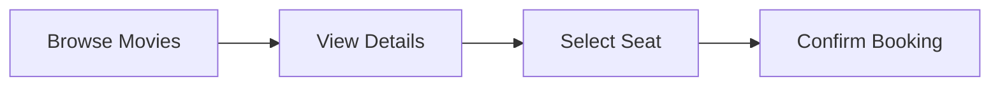

<!--
  Metadata for SEO Optimization
  Title: BookMyShow Clone - Advanced Movie Ticket Booking System
  Description: A high-performance BookMyShow Clone built with Java, Spring Boot, and React. Featuring a premium dark-mode UI, seat selection, and REST API.
  Keywords: BookMyShow Clone, Movie Booking System, Spring Boot React, Full Stack Java, Movie App
-->

# 🎬 BookMyShow Clone - Advanced Movie Ticket Booking System

A high-performance **BookMyShow Clone** and **Movie Ticket Booking System**. This project is a comprehensive **Full-Stack Java Project** featuring a **Spring Boot** backend and a **React 19** frontend with **Premium UI/UX**.

Designed for scalability and modern aesthetics, this **Movie Booking Application** serves as a perfect example of architecture using **Java 21**, **Spring Data JPA**, and **Glassmorphism Design**.

---

## 🔥 Key Features

- **🏠 Modern Home Page:** Discover movies with a sleek hero section and trending grid.
- **📱 Responsive Design:** Premium dark mode UI that works on all devices.
- **💺 Interactive Booking:** Visual seat selection with real-time price calculation.
- **🔍 Smart Search:** Quickly find movies, events, and theaters.
- **📖 API Docs:** Fully documented backend with Swagger UI.

---

## 🛠️ Tech Stack

| Frontend        | Backend           | Database        |
| :-------------- | :---------------- | :-------------- |
| React 19 + Vite | Spring Boot 3.x   | PostgreSQL      |
| TypeScript      | Java 21           | Hibernate / JPA |
| Framer Motion   | Spring Security   | Maven           |
| Lucide Icons    | Swagger / OpenAPI |                 |

---

## 🚀 Quick Setup

### 1️⃣ Backend (Spring Boot)

1. Create a database named `bms` in **MySQL**.
2. Open `src/main/resources/application.properties` and add your DB credentials.
3. Run the app:
   ```bash
   mvn spring-boot:run
   ```

### 2️⃣ Frontend (React)

1. In a new terminal, go to the frontend folder:
   ```bash
   cd frontend
   ```
2. Install dependencies & run:
   ```bash
   npm install
   npm run dev
   ```
3. Visit: [http://localhost:5173](http://localhost:5173)

---

## 📁 Project Structure

```text
BOOKMYSHOW/
├── frontend/             # React App (Components, Pages, Services)
├── src/main/java/        # Backend Logic (Entities, Services, Controllers)
├── src/main/resources/   # Config & SQL Seed Data
└── UI/                   # Legacy UI Files (Optional)
```

---

## 🧭 How it Works



---

## 🔗 Useful Links

- **Swagger API Docs:** [http://localhost:8080/swagger-ui/index.html](http://localhost:8080/swagger-ui/index.html)
- **Local Website:** [http://localhost:5173](http://localhost:5173)

Developed with ❤️ by the Project Team.
